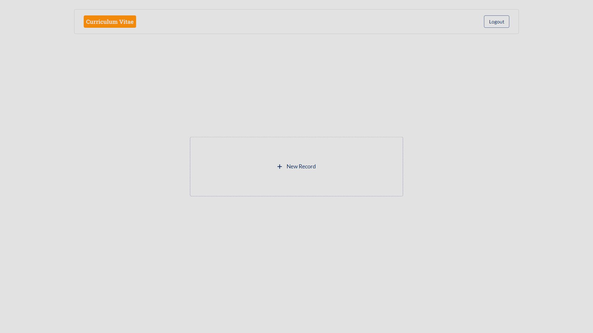
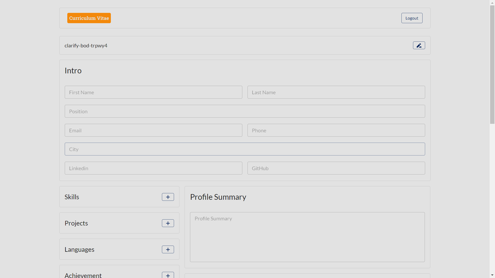
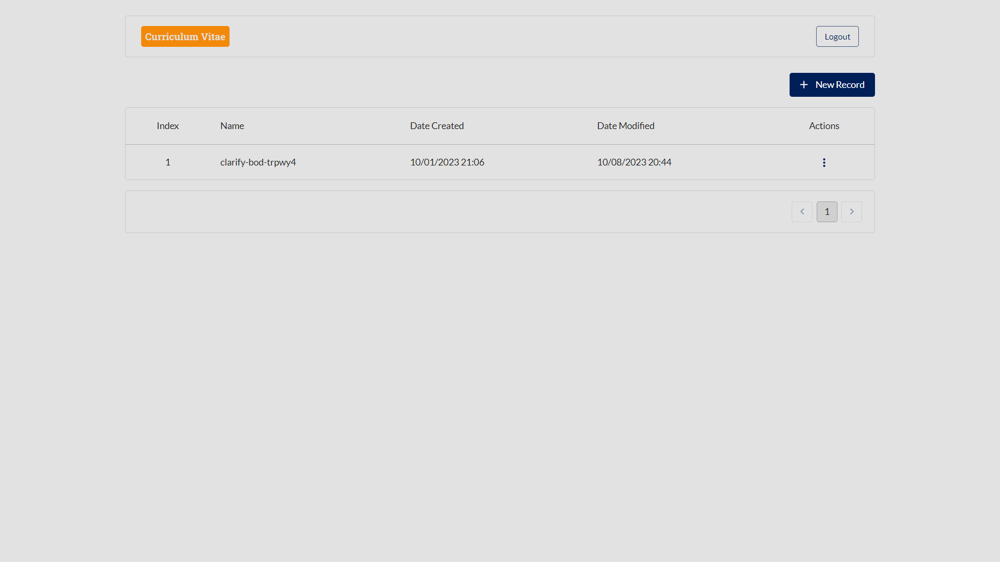

# CV

CV is a web application built using Next.js and MongoDB that allows users to create and manage their CVs (resumes) online. With features like CV form creation, preview, PDF download, and a CV management dashboard, it makes the process of creating and maintaining CVs easier than ever.

## Live Demo

Check out the live demo of CV [here](https://cv-one-alpha.vercel.app/).

## Features

- **CV Form**: Create and customize your CV by filling out a user-friendly form.
- **Preview**: Preview your CV before saving it (after filling out the form).
- **PDF Download**: Download your CV in PDF format for easy sharing and printing.
- **CV Management Dashboard**: Manage your CVs with features like delete, edit, and download from the dashboard.

## Technologies Used

- **Next.js**: A React framework for building fast and scalable web applications.
- **MongoDB**: A NoSQL database for storing user CV data.
- **Vercel**: Hosting platform for deploying and serving the application.

## Usage

1. Visit the CV application at the provided URL or run it locally.
2. Click on the `+ New Record` button to start building your CV.
3. Fill out the CV form with your personal and professional information.
4. Click the `Preview` button to review your CV's appearance.
5. If you're satisfied with your CV, click the `Save` button to store it.
6. You will be redirected to the home page dashboard, where you can `download`, `edit` or `delete` your CVs.

## Sample Screens

### Home Page

The home page provides an overview of the CV Builder application and allows users to create and manage their CVs.

### CV Form

The CV form is where users input their personal and professional information to create a CV.

<!-- ### CV Preview

Users can preview their CV's appearance before saving it. -->

### CV Management Dashboard

The dashboard allows users to manage their saved CVs, including downloading, editing, and deleting them.

## Thanks

Thanks to CHATGPT for generating this README.md file! If you have any questions or feedback about this website, please feel free to contact us. We welcome all feedback and suggestions!

## Contribution

Contributions are welcome! If you have any ideas for improvements or find any issues, please open an issue or submit a pull request.

## License

This project is licensed under the MIT License - see the [LICENSE](LICENSE) file for details.
